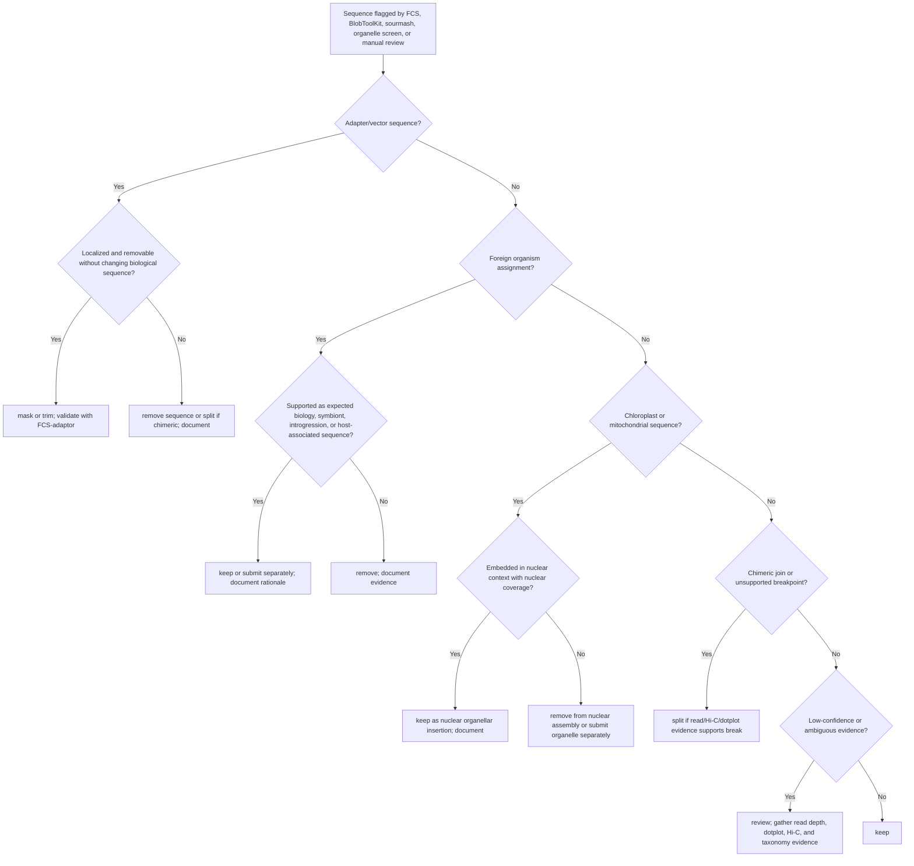

# Contamination Review Workflow

Contamination review is a release gate. A crop plant assembly should not be submitted publicly until adapter/vector sequence, foreign organism contamination, and unintended organellar sequence have been screened and documented.

## Recommended Evidence Layers

| Layer | Purpose | Typical tools |
| --- | --- | --- |
| Adapter/vector | Detect library artifacts and synthetic sequences | NCBI FCS-adaptor, VecScreen |
| Cross-species contamination | Detect bacterial, fungal, animal, or wrong-plant sequence | NCBI FCS-GX, BlobToolKit, BLAST |
| Read-level taxonomic signal | Check raw data before assembly | sourmash, Kraken2, Centrifuge |
| GC/coverage/taxonomy outliers | Find suspicious contig clusters | BlobToolKit |
| Organelle sequence | Separate free chloroplast/mitochondrial contigs from nuclear sequence | minimap2/BLAST against organelle references |

## Standard Directory Layout

```text
11_contamination/
  fcs_adaptor/
  fcs_gx/
  sourmash/
  blobtoolkit/
  organelle/
  decisions/
```

## sourmash Read Screening

Use sourmash to identify the closest taxonomic signatures in the reads and to catch obvious barcode/sample swaps before assembly.

```bash
sbatch \
  --export reads="03_reads_raw/sample.fastq.gz",sample=sample,database=/path/to/ncbi-euks-plants.dna.k51.sig.zip,k=51,scaled=1000 \
  01_sbatch/sourmash_reads.sbatch
```

Interpretation:

- The top containment hits should be the expected species, genus, or close relatives.
- Strong bacterial, fungal, animal, or unrelated plant hits require review.
- In crop projects, closely related species hits may reflect database composition rather than contamination.

## BlobToolKit Review

BlobToolKit is strongest when it combines assembly FASTA, read coverage, and taxonomic hits.

```bash
sbatch \
  --export assembly=07_assemblies/sample.primary.fa,reads="03_reads_raw/sample.fastq.gz",sample=sample,taxdump=/path/to/taxdump,blastdb=/path/to/blastdb \
  01_sbatch/blobtoolkit_prep.sbatch
```

Review:

- contigs with unusual GC content
- contigs with very high or low read coverage
- contigs assigned to non-plant taxa
- clusters matching chloroplast or mitochondria
- contigs with inconsistent taxonomic assignment and coverage

## FCS Review

Run FCS-adaptor and FCS-GX on release candidates. Follow current NCBI instructions because command syntax and database preparation can change.

```bash
sbatch \
  --export assembly=15_release/sample.genome.fa,sample=sample,fcs_image=/path/to/fcs-adaptor.sif \
  01_sbatch/fcs_adaptor.sbatch

sbatch \
  --export assembly=15_release/sample.genome.fa,sample=sample,taxid=NCBI_TAXID,fcs_image=/path/to/fcs-gx.sif,gx_db=/path/to/gxdb \
  01_sbatch/fcs_gx.sbatch
```

## Decision Categories

| Decision | Use when |
| --- | --- |
| keep | sequence is expected nuclear genome sequence |
| remove | sequence is clear contaminant or free organelle sequence not intended for nuclear release |
| mask | sequence should remain but be masked for submission or annotation |
| split | sequence is chimeric and a supported break is required |
| submit_separately | organelle or symbiont sequence should be released as its own record |
| review | evidence is insufficient for final action |

Every action other than keep should be represented in the contamination decision table and assembly decision log.

## Decision Tree



## Decision Table

| Evidence pattern | Recommended decision | Required follow-up |
| --- | --- | --- |
| Adapter/vector hit only | `mask`, `trim`, or `remove` | rerun FCS-adaptor |
| Mostly bacterial/fungal/animal contig, abnormal GC/coverage | `remove` | record taxonomic evidence and file checksum |
| Putative symbiont/endophyte sequence | `submit_separately` or `review` | confirm biological source and avoid mixing with nuclear genome |
| Complete chloroplast or mitochondrion | `remove` from nuclear assembly or `submit_separately` | prepare organelle-specific record if releasing |
| Organelle-like segment inside nuclear-depth contig | `keep` | annotate as nuclear organellar insertion if needed |
| Chimeric nuclear-organelle contig | `split` or `remove` | require read, dotplot, or Hi-C support |
| Short low-identity hit | `review` or `keep` | do not remove without stronger evidence |
